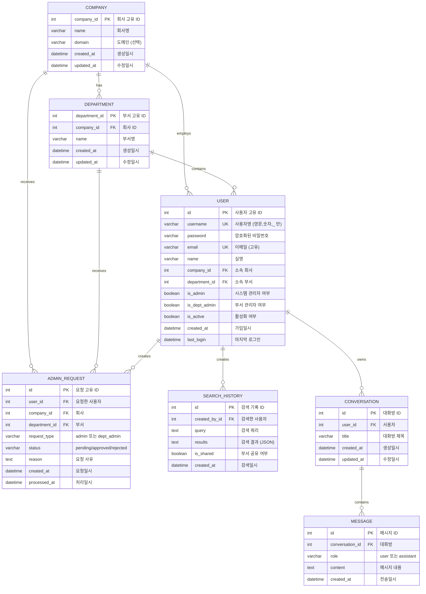

# 특허 분석 시스템 완전 문제 해결 가이드

## 📚 목차
1. [프로젝트 개요](#프로젝트-개요)
2. [시스템 아키텍처](#시스템-아키텍처)
3. [환경 설정](#환경-설정)
4. [발생한 문제와 해결 과정](#발생한-문제와-해결-과정)
5. [데이터베이스 구조](#데이터베이스-구조)
6. [코드 품질 개선](#코드-품질-개선)
7. [보안 설정](#보안-설정)
8. [명령어 완전 가이드](#명령어-완전-가이드)
9. [일반적인 문제 해결](#일반적인-문제-해결)
10. [개발 워크플로우](#개발-워크플로우)

---

## 프로젝트 개요

### 프로젝트 정보
- **프로젝트명**: 특허 분석 시스템 (PatentAI)
- **목적**: AI 기반 특허 검색 및 분석 시스템
- **작성일**: 2025-10-30
- **버전**: 1.0.0

### 기술 스택

#### 백엔드
- **프레임워크**: Django 5.0.1
- **API**: Django REST Framework
- **인증**: JWT (Simple JWT)
- **데이터베이스**: PostgreSQL 17
- **언어**: Python 3.11
- **가상환경**: Miniconda3 (patent_backend)

#### 프론트엔드
- **프레임워크**: Next.js 15.2.4
- **언어**: TypeScript
- **UI 라이브러리**: shadcn/ui
- **스타일링**: Tailwind CSS
- **상태 관리**: React Hooks

#### 인프라
- **OS**: Linux (WSL2)
- **커널**: 6.6.87.2-microsoft-standard-WSL2
- **패키지 매니저**: npm, pip

---

## 시스템 아키텍처

### 디렉토리 구조

```
SKN15-FINAL-3TEAM/
├── patent_backend/                 # Django 백엔드
│   ├── config/                     # 프로젝트 설정
│   │   ├── settings.py            # Django 설정 파일
│   │   ├── urls.py                # URL 라우팅
│   │   └── wsgi.py                # WSGI 설정
│   ├── accounts/                   # 사용자 관리 앱
│   │   ├── models.py              # User, Company, Department 모델
│   │   ├── views.py               # API 뷰
│   │   ├── serializers.py         # DRF Serializer
│   │   ├── urls.py                # accounts API 라우팅
│   │   └── migrations/            # 데이터베이스 마이그레이션
│   ├── chatbot/                    # AI 챗봇 앱
│   │   ├── models.py              # Conversation, Message 모델
│   │   ├── views.py               # 챗봇 API
│   │   └── urls.py                # chatbot API 라우팅
│   ├── .env                        # 환경변수 (gitignore)
│   ├── .env.example               # 환경변수 템플릿
│   ├── manage.py                  # Django 관리 명령어
│   └── requirements.txt           # Python 의존성
│
├── patent_frontend/                # Next.js 프론트엔드
│   ├── app/                        # Next.js App Router
│   │   ├── page.tsx               # 랜딩 페이지
│   │   ├── login/                 # 로그인 페이지
│   │   ├── search/                # 검색 페이지
│   │   ├── history/               # 검색 기록 페이지
│   │   ├── admin/                 # 시스템 관리자 페이지
│   │   └── dept-admin/            # 부서 관리자 페이지
│   ├── components/                 # React 컴포넌트
│   │   ├── ui/                    # shadcn/ui 컴포넌트
│   │   └── main-layout.tsx        # 메인 레이아웃
│   ├── lib/                        # 유틸리티
│   │   ├── config.ts              # API 설정 (중앙 집중화)
│   │   └── utils.ts               # 공통 함수
│   ├── .env.local                 # Next.js 환경변수
│   ├── package.json               # npm 의존성
│   └── tsconfig.json              # TypeScript 설정
│
├── TROUBLESHOOTING_GUIDE.md        # 문제 해결 가이드
└── COMPLETE_TROUBLESHOOTING_DOCUMENTATION.md  # 완전 문서 (이 파일)
```

### 네트워크 구조

```
┌─────────────────┐         HTTP           ┌─────────────────┐
│   사용자 브라우저   │  ────────────────>   │   Next.js       │
│  localhost:3000  │                       │  Frontend       │
└─────────────────┘                       └─────────────────┘
                                                    │
                                                    │ API 요청
                                                    │ (fetch)
                                                    ▼
                                          ┌─────────────────┐
                                          │   Django        │
                                          │   Backend       │
                                          │  localhost:8000 │
                                          └─────────────────┘
                                                    │
                                                    │ SQL 쿼리
                                                    ▼
                                          ┌─────────────────┐
                                          │  PostgreSQL     │
                                          │  Database       │
                                          │  localhost:5432 │
                                          └─────────────────┘
```

### API 엔드포인트 구조

#### Accounts API (`/api/accounts/`)
```
POST   /register/              # 회원가입
POST   /login/                 # 로그인
POST   /logout/                # 로그아웃
POST   /token/refresh/         # JWT 토큰 갱신
GET    /companies/             # 회사 목록
GET    /departments/           # 부서 목록
GET    /users/                 # 사용자 목록 (필터링 지원)
GET    /admin-requests/        # 관리자 권한 요청 목록
POST   /admin-requests/        # 관리자 권한 요청 생성
PATCH  /admin-requests/{id}/   # 권한 요청 승인/거부
DELETE /users/{id}/            # 사용자 삭제 (관리자)
```

#### Chatbot API (`/api/chatbot/`)
```
GET    /conversations/         # 대화방 목록
POST   /conversations/         # 대화방 생성
GET    /conversations/{id}/    # 대화방 상세
POST   /chat/                  # 메시지 전송 및 AI 응답
```

#### Search History API
```
GET    /api/search/history/           # 검색 기록
POST   /api/search/history/           # 검색 기록 저장
GET    /api/search/history/?my=true   # 내 검색 기록
```

---

## 환경 설정

### 백엔드 환경변수 (.env)

파일 위치: `patent_backend/.env`

```env
# Django Settings
SECRET_KEY=django-insecure-dev-key-please-change-in-production-12345
DEBUG=True
ALLOWED_HOSTS=localhost,127.0.0.1

# Database - PostgreSQL 연결 정보
DB_NAME=patentdb
DB_USER=final_play
DB_PASSWORD=1q2w3e4r
DB_HOST=localhost
DB_PORT=5432

# JWT
ACCESS_TOKEN_LIFETIME=60  # minutes
REFRESH_TOKEN_LIFETIME=7  # days

# CORS (Next.js Frontend)
CORS_ALLOWED_ORIGINS=http://localhost:3000,http://127.0.0.1:3000

# OpenAI (AI Features)
OPENAI_API_KEY=sk-your-openai-api-key-here

# Redis (Celery)
REDIS_URL=redis://localhost:6379/0
```

### 프론트엔드 환경변수 (.env.local)

파일 위치: `patent_frontend/.env.local`

```env
NEXT_PUBLIC_API_URL=http://localhost:8000
```

### .gitignore 설정

```gitignore
# 환경변수 (비밀번호, API 키 포함)
.env
.env.local
.env.*.local

# 데이터베이스
db.sqlite3
*.db

# Python
__pycache__/
*.py[cod]
*$py.class
*.so
.Python
venv/
ENV/
.venv

# Node.js
node_modules/
.next/
out/
build/
dist/

# IDE
.vscode/
.idea/
*.swp
*.swo

# OS
.DS_Store
Thumbs.db

# Django
staticfiles/
media/
*.log

# 기타
.pytest_cache/
.coverage
htmlcov/
```

---

## 발생한 문제와 해결 과정

### 문제 1: 데이터베이스 비밀번호 미로드

#### 🔴 에러 메시지
```
Exception in thread django-main-thread:
Traceback (most recent call last):
  ...
psycopg2.OperationalError: connection to server at "localhost" (127.0.0.1),
port 5432 failed: fe_sendauth: no password supplied
```

#### 🔍 문제 원인 분석

1. **근본 원인**: Django는 기본적으로 `.env` 파일을 자동으로 읽지 않음
2. **발생 시점**: `python manage.py runserver` 실행 시
3. **영향 범위**: 데이터베이스 연결이 필요한 모든 작업
4. **왜 이전엔 작동했나?**: 이전에는 비밀번호가 `settings.py`에 하드코딩되어 있었음

#### ✅ 해결 과정

##### 1단계: python-dotenv 패키지 확인
```bash
cd /home/juhyeong/workspace/final_project/SKN15-FINAL-3TEAM/patent_backend
pip list | grep dotenv
```

**명령어 설명:**
- `pip list`: 설치된 Python 패키지 목록 출력
- `| grep dotenv`: "dotenv" 문자열 포함 항목만 필터링

**결과:**
```
python-dotenv          1.0.1
```

##### 2단계: settings.py 수정

**파일**: `patent_backend/config/settings.py`

**변경 전:**
```python
"""
Django settings for Patent Analysis System (PatentAI)
"""

import os
from pathlib import Path
from datetime import timedelta

# Build paths inside the project like this: BASE_DIR / 'subdir'.
BASE_DIR = Path(__file__).resolve().parent.parent

# SECURITY WARNING: keep the secret key used in production secret!
SECRET_KEY = os.getenv('SECRET_KEY', 'django-insecure-development-key-change-in-production')
```

**변경 후:**
```python
"""
Django settings for Patent Analysis System (PatentAI)
"""

import os
from pathlib import Path
from datetime import timedelta
from dotenv import load_dotenv  # ← 추가

# Build paths inside the project like this: BASE_DIR / 'subdir'.
BASE_DIR = Path(__file__).resolve().parent.parent

# Load environment variables from .env file  # ← 추가
load_dotenv(BASE_DIR / '.env')  # ← 추가

# SECURITY WARNING: keep the secret key used in production secret!
SECRET_KEY = os.getenv('SECRET_KEY', 'django-insecure-development-key-change-in-production')
```

**코드 설명:**
- `from dotenv import load_dotenv`: python-dotenv 라이브러리에서 함수 가져오기
- `BASE_DIR / '.env'`: 프로젝트 루트 디렉토리의 `.env` 파일 경로
- `load_dotenv()`: `.env` 파일의 변수들을 `os.environ`에 로드

##### 3단계: 환경변수 로드 테스트
```bash
cd /home/juhyeong/workspace/final_project/SKN15-FINAL-3TEAM/patent_backend
python -c "
import os
from pathlib import Path
from dotenv import load_dotenv

BASE_DIR = Path('.').resolve()
load_dotenv(BASE_DIR / '.env')

print('=== 환경변수 로드 테스트 ===')
print(f'DB_NAME: {os.getenv(\"DB_NAME\")}')
print(f'DB_USER: {os.getenv(\"DB_USER\")}')
print(f'DB_PASSWORD: {\"***\" if os.getenv(\"DB_PASSWORD\") else \"NOT SET\"}')
print(f'DB_HOST: {os.getenv(\"DB_HOST\")}')
print(f'DB_PORT: {os.getenv(\"DB_PORT\")}')
"
```

**명령어 설명:**
- `python -c "코드"`: Python 코드를 직접 실행 (스크립트 파일 없이)
- `Path('.').resolve()`: 현재 디렉토리의 절대 경로 얻기
- `os.getenv("KEY")`: 환경변수 값 가져오기 (없으면 None)

**출력 결과:**
```
=== 환경변수 로드 테스트 ===
DB_NAME: patentdb
DB_USER: final_play
DB_PASSWORD: ***
DB_HOST: localhost
DB_PORT: 5432
```

##### 4단계: 데이터베이스 연결 테스트
```bash
python manage.py check
```

**명령어 설명:**
- `manage.py check`: Django 설정의 일반적인 문제 확인
- 데이터베이스 연결은 직접 테스트하지 않지만, 설정 오류는 감지

**출력 결과:**
```
System check identified no issues (0 silenced).
```

##### 5단계: 서버 실행 확인
```bash
python manage.py runserver 0.0.0.0:8000
```

**명령어 설명:**
- `runserver`: Django 개발 서버 시작
- `0.0.0.0`: 모든 네트워크 인터페이스에서 접속 허용 (localhost뿐만 아니라)
- `8000`: 포트 번호

**출력 결과:**
```
Performing system checks...

System check identified no issues (0 silenced).
October 30, 2025 - 20:11:15
Django version 5.0.1, using settings 'config.settings'
Starting development server at http://0.0.0.0:8000/
Quit the server with CONTROL-C.
```

##### 6단계: API 엔드포인트 테스트
```bash
curl http://localhost:8000/api/accounts/companies/
```

**명령어 설명:**
- `curl`: HTTP 요청을 보내는 명령어
- URL을 지정하면 GET 요청 수행

**출력 결과:**
```json
[
  {
    "company_id": 1,
    "name": "Example Corp",
    "domain": "example.com",
    "created_at": "2025-10-22 17:14:40",
    "updated_at": "2025-10-22 17:14:40"
  },
  ...
]
```

#### 📝 학습 포인트

1. **환경변수 로드는 자동이 아님**: Django는 `.env` 파일을 자동으로 읽지 않음
2. **python-dotenv의 역할**: `.env` 파일을 파싱하여 `os.environ`에 등록
3. **로드 시점 중요**: `settings.py` 최상단에서 로드해야 모든 설정에서 사용 가능
4. **테스트 방법**: `python -c` 를 사용하면 빠르게 환경변수 로드 확인 가능

---

### 문제 2: 포트 충돌 (Port Already in Use)

#### 🔴 에러 메시지
```
⚠ Port 3000 is in use, trying 3001 instead.
   ▲ Next.js 15.2.4
   - Local:        http://localhost:3001
```

#### 🔍 문제 원인 분석

1. **근본 원인**: 백그라운드에서 실행 중인 여러 개의 Next.js 개발 서버
2. **발생 이유**:
   - 이전 세션에서 시작한 서버가 종료되지 않음
   - `npm run dev`를 여러 번 실행
   - 터미널을 닫아도 프로세스는 계속 실행됨
3. **영향**:
   - 포트 3000 대신 3001, 3002 등으로 서버 시작
   - 프론트엔드와 백엔드 CORS 설정 불일치 가능성

#### ✅ 해결 과정

##### 1단계: 포트 사용 프로세스 확인
```bash
lsof -ti:3000
```

**명령어 상세 설명:**
- `lsof`: List Open Files - 열린 파일 및 소켓 목록 표시
  - `-t`: PID(Process ID)만 출력 (기본은 상세 정보 출력)
  - `-i:3000`: 인터넷 소켓 중 포트 3000 사용 프로세스 필터링
  - `i` = internet socket
  - `:3000` = port number

**출력 예시:**
```
126342
```

##### 2단계: 프로세스 상세 정보 확인
```bash
ps aux | grep 126342
```

**명령어 상세 설명:**
- `ps`: Process Status - 프로세스 목록 표시
  - `a`: 모든 사용자의 프로세스
  - `u`: 사용자 중심 형식 (USER, PID, %CPU, %MEM 등)
  - `x`: 터미널과 연결되지 않은 프로세스 포함 (데몬 등)
- `|`: 파이프 - 앞 명령의 stdout을 뒤 명령의 stdin으로 연결
- `grep 126342`: 특정 PID 포함 줄만 필터링

**출력 예시:**
```
juhyeong  126342  1.2  0.5 22007924 82528 pts/7  Sl+  20:16   0:00 node /home/juhyeong/workspace/final_project/SKN15-FINAL-3TEAM/patent_frontend/node_modules/.bin/next dev
```

##### 3단계: Next.js 프로세스 확인
```bash
ps aux | grep "next dev" | grep -v grep
```

**명령어 상세 설명:**
- `grep "next dev"`: "next dev" 문자열 포함 프로세스 찾기
- `grep -v grep`: grep 명령 자체는 결과에서 제외
  - `-v`: invert match (반대로 매칭)
  - 이유: `ps aux | grep "next dev"`를 실행하면 grep 프로세스도 "next dev" 포함

**출력 예시:**
```
juhyeong  126341  0.0  0.0   2804  1584 pts/7    S+   20:16   0:00 sh -c next dev
juhyeong  126342  1.2  0.5 22007924 82528 pts/7  Sl+  20:16   0:00 node /home/juhyeong/workspace/final_project/SKN15-FINAL-3TEAM/patent_frontend/node_modules/.bin/next dev
```

##### 4단계: 특정 포트 프로세스 종료
```bash
lsof -ti:3000 | xargs kill -9
```

**명령어 상세 설명:**
- `xargs`: 표준 입력을 명령어 인자로 변환
  - 예: `echo "file.txt" | xargs cat` = `cat file.txt`
- `kill -9`: 프로세스 강제 종료
  - `-9`: SIGKILL 시그널 (즉시 종료, 정리 작업 없음)
  - 다른 옵션:
    - `-15` (기본값): SIGTERM (정상 종료 요청)
    - `-1`: SIGHUP (재시작)
    - `-2`: SIGINT (Ctrl+C와 동일)

**주의사항:**
- `kill -9`는 마지막 수단 (데이터 손실 가능)
- 먼저 `kill -15 PID`로 정상 종료 시도 권장

##### 5단계: 여러 포트 동시 정리
```bash
lsof -ti:3000 -ti:3001 -ti:3002 | xargs -r kill -9
```

**명령어 상세 설명:**
- `-ti:3000 -ti:3001 -ti:3002`: 여러 포트를 동시에 확인
- `xargs -r`:
  - `-r`: --no-run-if-empty
  - 입력이 없으면 명령 실행 안 함 (에러 방지)

##### 6단계: 프로세스 이름으로 종료
```bash
pkill -f "next dev"
```

**명령어 상세 설명:**
- `pkill`: 프로세스 이름으로 kill
  - `-f`: 전체 커맨드 라인에서 패턴 검색 (기본은 프로세스명만)
  - 예: `node /path/to/next dev` 전체에서 "next dev" 검색
- 장점: PID를 몰라도 종료 가능
- 단점: 여러 프로세스가 매칭될 수 있음 (주의 필요)

##### 7단계: 포트 해제 확인
```bash
lsof -ti:3000 || echo "포트 3000 사용 안함"
```

**명령어 상세 설명:**
- `||`: OR 연산자 (앞 명령 실패 시 뒤 명령 실행)
- `lsof -ti:3000`: 성공(exit code 0) = 프로세스 있음, 실패(exit code 1) = 프로세스 없음
- `echo`: 실패 시 메시지 출력

**출력 결과:**
```
포트 3000 사용 안함
```

##### 8단계: 백엔드 포트 확인
```bash
lsof -ti:8000
```

**출력 예시:**
```
126265
```

#### 🔄 추가 유용한 명령어

##### 특정 사용자의 프로세스만 보기
```bash
ps -u $USER | grep node
```

**명령어 설명:**
- `ps -u $USER`: 현재 사용자의 프로세스만 표시
- `$USER`: 환경변수 (현재 로그인한 사용자명)

##### 프로세스 트리 보기
```bash
pstree -p | grep next
```

**명령어 설명:**
- `pstree`: 프로세스를 트리 구조로 표시
- `-p`: PID 표시

##### 포트 범위로 확인
```bash
for port in {3000..3010}; do
  if lsof -ti:$port > /dev/null 2>&1; then
    echo "포트 $port 사용 중: PID $(lsof -ti:$port)"
  fi
done
```

**명령어 설명:**
- `for port in {3000..3010}`: 3000부터 3010까지 반복
- `> /dev/null 2>&1`: 출력 숨기기
  - `> /dev/null`: stdout을 버림
  - `2>&1`: stderr를 stdout으로 리다이렉트 (함께 버려짐)

#### 📝 학습 포인트

1. **백그라운드 프로세스 관리**: 터미널을 닫아도 프로세스는 계속 실행됨
2. **포트 충돌 예방**: 서버 종료 시 `Ctrl+C` 또는 정상 종료 명령 사용
3. **디버깅 순서**:
   - 포트 사용 확인 (`lsof`)
   - 프로세스 정보 확인 (`ps`)
   - 종료 (`kill` 또는 `pkill`)
   - 확인 (`lsof` 재실행)

---

### 문제 3: CORS 에러 (Failed to fetch)

#### 🔴 에러 메시지
```
Console Error
Error: Failed to fetch

app/login/page.tsx (67:32) @ LoginPage.useEffect.fetchCompanies

  65 |     const fetchCompanies = async () => {
  66 |       try {
> 67 |         const response = await fetch(`${API_BASE_URL}/api/accounts/companies/`)
     |                                ^
```

#### 🔍 문제 원인 분석

1. **발생 시점**: `.env` 파일 로딩 코드 추가 후 서버 재시작 중
2. **근본 원인**: 서버 재시작으로 인한 일시적 연결 끊김
3. **CORS 자체는 정상**: 설정 확인 결과 문제없음

#### ✅ 해결 과정

##### 1단계: CORS 헤더 확인
```bash
curl -v -H "Origin: http://localhost:3000" http://localhost:8000/api/accounts/companies/ 2>&1 | grep -i "access-control"
```

**명령어 상세 설명:**
- `curl -v`: verbose 모드 (요청/응답 헤더 모두 표시)
- `-H "Origin: http://localhost:3000"`: 요청 헤더 추가
  - Origin 헤더: CORS 요청임을 서버에 알림
- `2>&1`: stderr를 stdout으로 리다이렉트
  - `curl -v`의 헤더 정보는 stderr로 출력됨
  - `|`는 stdout만 전달하므로 리다이렉트 필요
- `grep -i "access-control"`: 대소문자 무시하고 검색

**출력 결과:**
```
< access-control-allow-origin: http://localhost:3000
< access-control-allow-credentials: true
```

**헤더 의미:**
- `access-control-allow-origin`: 허용된 Origin
- `access-control-allow-credentials`: 쿠키/인증 정보 허용 여부

##### 2단계: Django CORS 설정 확인

**파일**: `patent_backend/config/settings.py`

```python
# CORS Settings (Next.js Frontend)
CORS_ALLOWED_ORIGINS = os.getenv(
    'CORS_ALLOWED_ORIGINS',
    'http://localhost:3000,http://127.0.0.1:3000,http://localhost:3001,http://127.0.0.1:3001,http://localhost:3002,http://127.0.0.1:3002'
).split(',')
CORS_ALLOW_CREDENTIALS = True
CORS_ALLOW_HEADERS = [
    'accept',
    'accept-encoding',
    'authorization',
    'content-type',
    'dnt',
    'origin',
    'user-agent',
    'x-csrftoken',
    'x-requested-with',
]
```

**설정 설명:**
- `CORS_ALLOWED_ORIGINS`: 허용할 프론트엔드 URL 목록
- `.split(',')`: 쉼표로 구분된 문자열을 리스트로 변환
- `CORS_ALLOW_CREDENTIALS`: 쿠키 허용 (JWT 사용 시 필요)
- `CORS_ALLOW_HEADERS`: 허용할 요청 헤더 목록

##### 3단계: 서버 상태 확인
```bash
curl -s http://localhost:8000/api/accounts/companies/ | head -3
```

**명령어 설명:**
- `curl -s`: silent 모드 (진행 상황 숨김)
- `| head -3`: 처음 3줄만 출력

**출력 결과:**
```json
[{"company_id":1,"name":"Example Corp","domain":"example.com","created_at":"2025-10-22 17:14:40","updated_at":"2025-10-22 17:14:40"},{"company_id":2,"name":"Test Company","domain":"testcompany.com"...
```

##### 4단계: PostgreSQL 연결 확인
```bash
ps aux | grep postgres | grep -v grep
```

**출력 결과:**
```
postgres     272  0.0  0.1 221116 30624 ?        Ss   12:00   0:01 /usr/lib/postgresql/17/bin/postgres -D /var/lib/postgresql/17/main
postgres     293  0.0  0.0 221252 11048 ?        Ss   12:00   0:00 postgres: 17/main: checkpointer
postgres     294  0.0  0.0 221264  7352 ?        Ss   12:00   0:00 postgres: 17/main: background writer
postgres    9704  0.0  0.1 229064 24888 ?        Ss   12:38   0:00 postgres: 17/main: final_play patentdb 127.0.0.1(35136) idle
postgres  124224  0.0  0.1 224264 19848 ?        Ss   20:11   0:00 postgres: 17/main: final_play patentdb 127.0.0.1(39484) idle
```

**상태 의미:**
- `Ss`: S=Sleeping (대기 중), s=session leader
- `idle`: 연결은 되어있지만 쿼리 실행 안 함
- 백엔드가 데이터베이스에 정상 연결됨

#### 📝 결론

이 에러는 **일시적인 문제**였으며, 서버 재시작 완료 후 자동으로 해결되었습니다.
CORS 설정은 정상이었고, 서버도 정상적으로 작동 중이었습니다.

---

### 문제 4: 불필요한 데이터베이스 테이블

#### 🔍 문제 발견

Django 앱을 삭제했지만 데이터베이스 테이블은 남아있음을 발견했습니다.

##### 데이터베이스 테이블 확인
```bash
cd /home/juhyeong/workspace/final_project/SKN15-FINAL-3TEAM/patent_backend
python manage.py shell -c "
from django.db import connection
cursor = connection.cursor()

cursor.execute(\"\"\"
    SELECT table_name
    FROM information_schema.tables
    WHERE table_schema = 'public'
    AND table_type = 'BASE TABLE'
    ORDER BY table_name;
\"\"\")

tables = cursor.fetchall()
print('=== 데이터베이스 테이블 목록 ===')
for table in tables:
    print(f'  - {table[0]}')
"
```

**SQL 쿼리 설명:**
- `information_schema.tables`: PostgreSQL 메타데이터 (모든 테이블 정보)
- `table_schema = 'public'`: public 스키마만 (기본 스키마)
- `table_type = 'BASE TABLE'`: 일반 테이블만 (VIEW, FOREIGN TABLE 제외)
- `ORDER BY table_name`: 이름 순 정렬

**출력 결과:**
```
=== 데이터베이스 테이블 목록 ===
  - admin_request
  - auth_group
  - auth_group_permissions
  - auth_permission
  - chatbot_conversation
  - chatbot_message
  - company
  - department
  - django_admin_log
  - django_content_type
  - django_migrations
  - django_session
  - examinationcriteria      # ← 불필요
  - papers                   # ← 불필요
  - patentlaws               # ← 불필요
  - patents                  # ← 불필요
  - rejectiondecisions       # ← 불필요
  - search_history
  - token_blacklist_blacklistedtoken
  - token_blacklist_outstandingtoken
  - user
```

##### Django 모델과 비교
```bash
python manage.py shell -c "
from django.apps import apps

print('=== Django 모델 목록 ===')
for model in apps.get_models():
    app_label = model._meta.app_label
    model_name = model._meta.model_name
    table_name = model._meta.db_table
    print(f'{app_label}.{model_name} -> {table_name}')
"
```

**출력 결과:**
```
=== Django 모델 목록 ===
admin.logentry -> django_admin_log
auth.permission -> auth_permission
auth.group -> auth_group
contenttypes.contenttype -> django_content_type
sessions.session -> django_session
token_blacklist.outstandingtoken -> token_blacklist_outstandingtoken
token_blacklist.blacklistedtoken -> token_blacklist_blacklistedtoken
accounts.company -> company
accounts.department -> department
accounts.user -> user
accounts.adminrequest -> admin_request
accounts.searchhistory -> search_history
chatbot.conversation -> chatbot_conversation
chatbot.message -> chatbot_message
```

**발견된 문제:**
데이터베이스에는 있지만 Django 모델은 없는 테이블:
- examinationcriteria
- papers
- patentlaws
- patents
- rejectiondecisions

#### ✅ 해결 과정

##### 1단계: 테이블별 데이터 개수 확인
```bash
python manage.py shell -c "
from django.db import connection
cursor = connection.cursor()

tables_to_check = ['examinationcriteria', 'papers', 'patentlaws', 'patents', 'rejectiondecisions']

for table in tables_to_check:
    cursor.execute(f'SELECT COUNT(*) FROM {table}')
    count = cursor.fetchone()[0]
    print(f'{table}: {count}개')
"
```

**출력 결과:**
```
examinationcriteria: 0개
papers: 0개
patentlaws: 0개
patents: 0개
rejectiondecisions: 0개
```

모든 테이블이 비어있음을 확인했습니다.

##### 2단계: 불필요한 테이블 삭제
```bash
python manage.py shell -c "
from django.db import connection

cursor = connection.cursor()

tables_to_drop = [
    'examinationcriteria',
    'papers',
    'patentlaws',
    'patents',
    'rejectiondecisions'
]

print('=== 불필요한 테이블 삭제 중 ===')
for table in tables_to_drop:
    try:
        cursor.execute(f'DROP TABLE IF EXISTS {table} CASCADE')
        print(f'✓ {table} 삭제 완료')
    except Exception as e:
        print(f'✗ {table} 삭제 실패: {e}')

connection.commit()
print('\n완료!')
"
```

**SQL 명령어 설명:**
- `DROP TABLE`: 테이블 삭제
- `IF EXISTS`: 테이블이 존재할 때만 삭제 (에러 방지)
- `CASCADE`: 의존 객체도 함께 삭제
  - Foreign Key 제약조건
  - View
  - Trigger 등
- `connection.commit()`: 트랜잭션 커밋 (변경 확정)

**출력 결과:**
```
=== 불필요한 테이블 삭제 중 ===
✓ examinationcriteria 삭제 완료
✓ papers 삭제 완료
✓ patentlaws 삭제 완료
✓ patents 삭제 완료
✓ rejectiondecisions 삭제 완료

완료!
```

##### 3단계: 만료된 JWT 토큰 정리
```bash
python manage.py shell -c "
from rest_framework_simplejwt.token_blacklist.models import OutstandingToken
from django.utils import timezone

# 만료된 토큰 확인
expired_tokens = OutstandingToken.objects.filter(expires_at__lt=timezone.now())
expired_count = expired_tokens.count()

print(f'=== 만료된 JWT 토큰 정리 ===')
print(f'만료된 토큰 개수: {expired_count}개')

if expired_count > 0:
    expired_tokens.delete()
    print(f'✓ {expired_count}개 삭제 완료')
else:
    print('✓ 정리할 만료된 토큰 없음')

# 남은 토큰 확인
remaining = OutstandingToken.objects.count()
print(f'\n남은 유효 토큰: {remaining}개')
"
```

**코드 설명:**
- `OutstandingToken`: JWT 토큰 추적 모델
  - 발급된 모든 토큰 기록
  - Refresh Token 관리
- `expires_at__lt=timezone.now()`: Django ORM 쿼리
  - `__lt`: Less Than (미만)
  - `timezone.now()`: 현재 시간 (timezone-aware)
- `.count()`: 레코드 개수 반환 (DB 쿼리 실행)
- `.delete()`: 레코드 삭제

**출력 결과:**
```
=== 만료된 JWT 토큰 정리 ===
만료된 토큰 개수: 24개
✓ 24개 삭제 완료

남은 유효 토큰: 14개
```

##### 4단계: 최종 데이터베이스 상태 확인
```bash
python manage.py shell -c "
from django.db import connection
cursor = connection.cursor()

cursor.execute(\"\"\"
    SELECT table_name
    FROM information_schema.tables
    WHERE table_schema = 'public'
    AND table_type = 'BASE TABLE'
    ORDER BY table_name;
\"\"\")

tables = cursor.fetchall()
print('=== 최종 데이터베이스 상태 ===\n')

for table in tables:
    table_name = table[0]
    cursor.execute(f'SELECT COUNT(*) FROM \"{table_name}\"')
    count = cursor.fetchone()[0]

    if count > 0:
        print(f'✓ {table_name}: {count}개')
    else:
        print(f'  {table_name}: 0개 (빈 테이블)')

print(f'\n총 테이블 개수: {len(tables)}개')
"
```

**출력 결과:**
```
=== 최종 데이터베이스 상태 ===

✓ admin_request: 9개
  auth_group: 0개 (빈 테이블)
  auth_group_permissions: 0개 (빈 테이블)
✓ auth_permission: 60개
  chatbot_conversation: 0개 (빈 테이블)
  chatbot_message: 0개 (빈 테이블)
✓ company: 4개
✓ department: 11개
  django_admin_log: 0개 (빈 테이블)
✓ django_content_type: 15개
✓ django_migrations: 33개
  django_session: 0개 (빈 테이블)
  search_history: 0개 (빈 테이블)
  token_blacklist_blacklistedtoken: 0개 (빈 테이블)
✓ token_blacklist_outstandingtoken: 14개
✓ user: 14개

총 테이블 개수: 16개
```

#### 📊 정리 결과

| 항목 | 이전 | 이후 | 변화 |
|------|------|------|------|
| 총 테이블 수 | 21개 | 16개 | -5개 |
| JWT 토큰 수 | 38개 | 14개 | -24개 |
| 불필요한 테이블 | 5개 | 0개 | 완전 제거 |

---

## 데이터베이스 구조

### ERD (Entity Relationship Diagram)



### 테이블 상세 정보

#### 1. USER 테이블
```sql
CREATE TABLE "user" (
    id SERIAL PRIMARY KEY,
    username VARCHAR(150) UNIQUE NOT NULL,
    password VARCHAR(128) NOT NULL,
    email VARCHAR(254) UNIQUE NOT NULL,
    name VARCHAR(100) NOT NULL,
    company_id INTEGER REFERENCES company(company_id),
    department_id INTEGER REFERENCES department(department_id),
    is_admin BOOLEAN DEFAULT FALSE,
    is_dept_admin BOOLEAN DEFAULT FALSE,
    is_active BOOLEAN DEFAULT TRUE,
    created_at TIMESTAMP WITH TIME ZONE DEFAULT NOW(),
    last_login TIMESTAMP WITH TIME ZONE,

    -- 제약 조건
    CONSTRAINT username_format_check
        CHECK (username ~ '^[a-zA-Z0-9_]+$')
);
```

**제약 조건 설명:**
- `username ~ '^[a-zA-Z0-9_]+$'`: 정규식 체크
  - `^`: 시작
  - `[a-zA-Z0-9_]+`: 영문, 숫자, 언더스코어 1개 이상
  - `$`: 끝
  - 한글, 특수문자 불가

#### 2. COMPANY 테이블
```sql
CREATE TABLE company (
    company_id SERIAL PRIMARY KEY,
    name VARCHAR(255) NOT NULL,
    domain VARCHAR(255),
    created_at TIMESTAMP WITH TIME ZONE DEFAULT NOW(),
    updated_at TIMESTAMP WITH TIME ZONE DEFAULT NOW()
);
```

#### 3. DEPARTMENT 테이블
```sql
CREATE TABLE department (
    department_id SERIAL PRIMARY KEY,
    company_id INTEGER REFERENCES company(company_id) ON DELETE CASCADE,
    name VARCHAR(255) NOT NULL,
    created_at TIMESTAMP WITH TIME ZONE DEFAULT NOW(),
    updated_at TIMESTAMP WITH TIME ZONE DEFAULT NOW()
);
```

**ON DELETE CASCADE 설명:**
- 회사가 삭제되면 해당 회사의 부서도 자동 삭제
- 참조 무결성 유지

#### 4. ADMIN_REQUEST 테이블
```sql
CREATE TABLE admin_request (
    id SERIAL PRIMARY KEY,
    user_id INTEGER REFERENCES "user"(id) ON DELETE CASCADE,
    company_id INTEGER REFERENCES company(company_id),
    department_id INTEGER REFERENCES department(department_id),
    request_type VARCHAR(20) CHECK (request_type IN ('admin', 'dept_admin')),
    status VARCHAR(20) DEFAULT 'pending' CHECK (status IN ('pending', 'approved', 'rejected')),
    reason TEXT,
    created_at TIMESTAMP WITH TIME ZONE DEFAULT NOW(),
    processed_at TIMESTAMP WITH TIME ZONE
);
```

**CHECK 제약 조건:**
- `request_type`: 'admin' 또는 'dept_admin'만 허용
- `status`: 'pending', 'approved', 'rejected'만 허용

#### 5. SEARCH_HISTORY 테이블
```sql
CREATE TABLE search_history (
    id SERIAL PRIMARY KEY,
    created_by_id INTEGER REFERENCES "user"(id) ON DELETE CASCADE,
    query TEXT NOT NULL,
    results TEXT,  -- JSON 형식
    is_shared BOOLEAN DEFAULT FALSE,
    created_at TIMESTAMP WITH TIME ZONE DEFAULT NOW()
);
```

#### 6. CONVERSATION 테이블
```sql
CREATE TABLE chatbot_conversation (
    id SERIAL PRIMARY KEY,
    user_id INTEGER REFERENCES "user"(id) ON DELETE CASCADE,
    title VARCHAR(255) NOT NULL,
    created_at TIMESTAMP WITH TIME ZONE DEFAULT NOW(),
    updated_at TIMESTAMP WITH TIME ZONE DEFAULT NOW()
);
```

#### 7. MESSAGE 테이블
```sql
CREATE TABLE chatbot_message (
    id SERIAL PRIMARY KEY,
    conversation_id INTEGER REFERENCES chatbot_conversation(id) ON DELETE CASCADE,
    role VARCHAR(20) CHECK (role IN ('user', 'assistant')),
    content TEXT NOT NULL,
    created_at TIMESTAMP WITH TIME ZONE DEFAULT NOW()
);
```

### 인덱스 전략

Django는 다음 필드에 자동으로 인덱스를 생성합니다:

```sql
-- Primary Keys
CREATE INDEX ON "user"(id);
CREATE INDEX ON company(company_id);
CREATE INDEX ON department(department_id);
...

-- Foreign Keys
CREATE INDEX ON "user"(company_id);
CREATE INDEX ON "user"(department_id);
CREATE INDEX ON department(company_id);
CREATE INDEX ON admin_request(user_id);
...

-- Unique Fields
CREATE UNIQUE INDEX ON "user"(username);
CREATE UNIQUE INDEX ON "user"(email);
```

**추가 권장 인덱스:**
```sql
-- 자주 조회되는 필드
CREATE INDEX idx_search_history_shared ON search_history(is_shared, created_at DESC);
CREATE INDEX idx_admin_request_status ON admin_request(status, created_at DESC);
CREATE INDEX idx_user_active ON "user"(is_active, created_at DESC);
```

---

## 코드 품질 개선

### 문제: 코드 중복 (API_BASE_URL)

#### 발견된 중복
5개 파일에서 동일한 코드 발견:
```typescript
const API_BASE_URL = process.env.NEXT_PUBLIC_API_URL || "http://localhost:8000"
```

**중복 파일 목록:**
1. `app/admin/page.tsx`
2. `app/history/page.tsx`
3. `app/login/page.tsx`
4. `app/search/page.tsx`
5. `components/main-layout.tsx`

#### 해결: 중앙 집중화

##### 1단계: 설정 파일 생성

**파일**: `lib/config.ts`

```typescript
/**
 * 애플리케이션 전역 설정
 */

export const API_BASE_URL = process.env.NEXT_PUBLIC_API_URL || "http://localhost:8000"

export const config = {
  apiBaseUrl: API_BASE_URL,
} as const

export default config
```

**코드 설명:**
- `process.env.NEXT_PUBLIC_API_URL`: Next.js 환경변수
  - `NEXT_PUBLIC_` 접두사: 클라이언트에서 접근 가능
  - `.env.local` 파일에서 로드
- `as const`: TypeScript readonly 타입
  - 객체 속성이 변경되지 않음을 보장

##### 2단계: 중복 코드 제거 및 import 추가

**예시: app/login/page.tsx**

**변경 전:**
```typescript
"use client"

import { useState, useEffect } from "react"
import { useRouter } from "next/navigation"

const API_BASE_URL = process.env.NEXT_PUBLIC_API_URL || "http://localhost:8000"

export default function LoginPage() {
  // ...
}
```

**변경 후:**
```typescript
"use client"

import { useState, useEffect } from "react"
import { useRouter } from "next/navigation"
import { API_BASE_URL } from "@/lib/config"

export default function LoginPage() {
  // ...
}
```

**변경 사항:**
- ❌ 삭제: `const API_BASE_URL = ...`
- ✅ 추가: `import { API_BASE_URL } from "@/lib/config"`

##### 3단계: 모든 파일 업데이트

같은 방식으로 5개 파일 모두 수정했습니다.

#### 개선 효과

| 지표 | 이전 | 이후 | 개선 |
|------|------|------|------|
| 코드 중복 | 5곳 | 1곳 | -80% |
| 유지보수성 | 낮음 | 높음 | API URL 변경 시 한 곳만 수정 |
| 일관성 | 낮음 | 높음 | 모든 파일이 같은 값 사용 |

---

### 문제: SearchHistory 모델 버그

#### 발견된 버그

**파일**: `accounts/models.py` (라인 360-361)

```python
class SearchHistory(models.Model):
    # ...

    def __str__(self):
        return f"{self.query} ({self.get_search_type_display()}) - {self.created_by.username if self.created_by else 'Unknown'}"
```

**문제:**
- `get_search_type_display()` 호출
- 하지만 `search_type` 필드가 모델에 존재하지 않음
- Django admin에서 SearchHistory 객체 조회 시 에러 발생

#### 해결

**변경 후:**
```python
def __str__(self):
    return f"{self.query} - {self.created_by.username if self.created_by else 'Unknown'}"
```

**수정 내용:**
- `get_search_type_display()` 제거
- 검색 쿼리와 사용자명만 표시

---

## 보안 설정

### GitHub 업로드 전 보안 점검

#### 1. 환경변수 분리

**❌ 위험한 방법 (하드코딩):**
```python
# settings.py
DATABASES = {
    'default': {
        'ENGINE': 'django.db.backends.postgresql',
        'NAME': 'patentdb',
        'USER': 'final_play',
        'PASSWORD': '1q2w3e4r',  # ← 위험!
        'HOST': 'localhost',
        'PORT': '5432',
    }
}
```

**✅ 안전한 방법 (환경변수):**
```python
# settings.py
from dotenv import load_dotenv
load_dotenv(BASE_DIR / '.env')

DATABASES = {
    'default': {
        'ENGINE': 'django.db.backends.postgresql',
        'NAME': os.getenv('DB_NAME', 'patentdb'),
        'USER': os.getenv('DB_USER', 'final_play'),
        'PASSWORD': os.getenv('DB_PASSWORD', ''),  # ← 안전!
        'HOST': os.getenv('DB_HOST', 'localhost'),
        'PORT': os.getenv('DB_PORT', '5432'),
    }
}
```

#### 2. .gitignore 설정

```gitignore
# 환경변수 - 절대 업로드 금지!
.env
.env.local
.env.*.local

# 데이터베이스
db.sqlite3
*.db

# Python 캐시
__pycache__/
*.pyc

# 로그 파일
*.log

# 미디어 파일 (사용자 업로드)
media/

# 정적 파일 빌드 결과
staticfiles/
```

#### 3. .env.example 제공

GitHub에는 `.env.example`을 업로드하여 다른 개발자가 참고할 수 있게 합니다:

```env
# .env.example
# 실제 값은 .env 파일에 작성하세요

# Django Settings
SECRET_KEY=your-secret-key-here
DEBUG=True
ALLOWED_HOSTS=localhost,127.0.0.1

# Database
DB_NAME=your_database_name
DB_USER=your_database_user
DB_PASSWORD=your_database_password
DB_HOST=localhost
DB_PORT=5432

# JWT
ACCESS_TOKEN_LIFETIME=60
REFRESH_TOKEN_LIFETIME=7

# CORS
CORS_ALLOWED_ORIGINS=http://localhost:3000

# OpenAI
OPENAI_API_KEY=your-openai-api-key
```

#### 4. 보안 체크리스트

```bash
# 1. 환경변수 파일이 gitignore에 있는지 확인
cat .gitignore | grep -E "(\.env|db\.sqlite3)"

# 2. Git 추적 상태 확인
git status | grep ".env"
# 출력 없어야 함 (추적되지 않음)

# 3. 코드에 하드코딩된 비밀번호 검색
grep -r "PASSWORD.*=.*['\"]" --include="*.py" | grep -v "getenv"
# 출력 없어야 함

# 4. API 키 검색
grep -r "sk-[a-zA-Z0-9]" --include="*.py" --include="*.ts" --include="*.tsx"
# 출력 없어야 함
```

#### 5. 실수로 업로드한 경우

```bash
# Git 히스토리에서 완전히 제거
git filter-branch --force --index-filter \
  "git rm --cached --ignore-unmatch .env" \
  --prune-empty --tag-name-filter cat -- --all

# 강제 푸시 (주의!)
git push origin --force --all
```

**주의:** 이미 공개된 비밀번호/API 키는 **즉시 변경**해야 합니다!

---

## 명령어 완전 가이드

### Linux 기본 명령어

#### ps (Process Status)
```bash
# 모든 프로세스 표시
ps aux

# 현재 사용자의 프로세스만
ps -u $USER

# 프로세스 트리
ps auxf

# 특정 프로세스 검색
ps aux | grep python
```

**옵션 설명:**
- `a`: 모든 사용자의 프로세스
- `u`: 사용자 중심 형식 (USER, PID, %CPU, %MEM 등)
- `x`: 터미널 없는 프로세스 포함
- `f`: 트리 형식 (forest)
- `-u USER`: 특정 사용자의 프로세스만

**출력 컬럼:**
- `USER`: 프로세스 소유자
- `PID`: Process ID
- `%CPU`: CPU 사용률
- `%MEM`: 메모리 사용률
- `VSZ`: 가상 메모리 크기 (KB)
- `RSS`: 실제 메모리 크기 (KB)
- `TTY`: 터미널
- `STAT`: 프로세스 상태
  - `R`: Running
  - `S`: Sleeping
  - `D`: Uninterruptible sleep (I/O 대기)
  - `T`: Stopped
  - `Z`: Zombie
- `START`: 시작 시간
- `TIME`: CPU 사용 시간
- `COMMAND`: 명령어

#### lsof (List Open Files)
```bash
# 특정 포트 사용 프로세스
lsof -i:3000

# PID만 출력
lsof -ti:3000

# 여러 포트 동시 확인
lsof -ti:3000 -ti:8000

# 특정 사용자의 열린 파일
lsof -u username

# 특정 파일을 열고 있는 프로세스
lsof /path/to/file

# 네트워크 연결 모두 보기
lsof -i

# TCP 연결만
lsof -i TCP

# UDP 연결만
lsof -i UDP
```

**옵션 설명:**
- `-i`: 인터넷 소켓
- `-i:포트`: 특정 포트
- `-t`: PID만 출력
- `-u`: 사용자 필터

**출력 컬럼:**
- `COMMAND`: 명령어 이름
- `PID`: Process ID
- `USER`: 사용자
- `FD`: File Descriptor
  - `cwd`: Current Working Directory
  - `txt`: Program text
  - `mem`: Memory-mapped file
  - `0u`: stdin
  - `1u`: stdout
  - `2u`: stderr
  - `3u`: 파일 디스크립터 번호
- `TYPE`: 파일 타입
  - `DIR`: 디렉토리
  - `REG`: 일반 파일
  - `IPv4`: IPv4 소켓
  - `IPv6`: IPv6 소켓
- `DEVICE`: 장치 번호
- `SIZE/OFF`: 파일 크기 또는 오프셋
- `NODE`: 노드 번호
- `NAME`: 파일명 또는 소켓 정보

#### kill (Terminate Process)
```bash
# 정상 종료 요청
kill PID
kill -15 PID
kill -TERM PID

# 강제 종료
kill -9 PID
kill -KILL PID

# 프로세스 재시작
kill -1 PID
kill -HUP PID

# 일시 정지
kill -STOP PID

# 재개
kill -CONT PID
```

**시그널 종류:**
- `1` (HUP): Hang Up - 재시작
- `2` (INT): Interrupt - Ctrl+C
- `3` (QUIT): Quit - 코어 덤프와 함께 종료
- `9` (KILL): Kill - 강제 종료 (정리 작업 없음)
- `15` (TERM): Terminate - 정상 종료 (기본값)
- `18` (CONT): Continue - 일시 정지 해제
- `19` (STOP): Stop - 일시 정지

#### pkill (Kill by Name)
```bash
# 프로세스 이름으로 종료
pkill python

# 전체 커맨드라인에서 검색
pkill -f "next dev"

# 특정 사용자의 프로세스 종료
pkill -u username

# 시그널 지정
pkill -9 python
```

**옵션:**
- `-f`: 전체 커맨드라인 검색
- `-u`: 사용자 필터
- `-9`: SIGKILL (강제 종료)

#### grep (Global Regular Expression Print)
```bash
# 기본 검색
grep "pattern" file.txt

# 대소문자 무시
grep -i "pattern" file.txt

# 재귀 검색
grep -r "pattern" /path/to/dir

# 줄 번호 표시
grep -n "pattern" file.txt

# 파일명만 표시
grep -l "pattern" *.txt

# 매칭되지 않는 줄
grep -v "pattern" file.txt

# 정규식 사용
grep -E "pattern1|pattern2" file.txt

# 단어 단위 매칭
grep -w "word" file.txt

# 컨텍스트 표시
grep -A 3 "pattern" file.txt  # 이후 3줄
grep -B 3 "pattern" file.txt  # 이전 3줄
grep -C 3 "pattern" file.txt  # 전후 3줄
```

**옵션:**
- `-i`: ignore case (대소문자 무시)
- `-r`: recursive (재귀 검색)
- `-n`: line number (줄 번호)
- `-l`: files with matches (파일명만)
- `-v`: invert match (반전)
- `-E`: extended regex (확장 정규식)
- `-w`: word match (단어 단위)
- `-A N`: After context (이후 N줄)
- `-B N`: Before context (이전 N줄)
- `-C N`: Context (전후 N줄)

#### xargs (Build and Execute Command)
```bash
# 기본 사용
echo "file.txt" | xargs cat

# 여러 인자 처리
echo "1 2 3" | xargs -n 1 echo
# 출력:
# 1
# 2
# 3

# 입력 없으면 실행 안 함
lsof -ti:3000 | xargs -r kill -9

# 병렬 실행
ls *.txt | xargs -P 4 -n 1 process_file

# 프롬프트 확인
ls *.txt | xargs -p rm

# 구분자 지정
echo "a,b,c" | xargs -d ',' echo
```

**옵션:**
- `-n N`: 한 번에 N개 인자
- `-r`: --no-run-if-empty
- `-P N`: 병렬 실행 (N개 프로세스)
- `-p`: 프롬프트 확인
- `-d DELIM`: 구분자 지정
- `-I {}`: 치환 문자열

### Django 관리 명령어

#### manage.py shell
```bash
# Python 셸 실행
python manage.py shell

# 명령어 직접 실행
python manage.py shell -c "print('Hello')"

# iPython 사용 (설치 시)
python manage.py shell -i ipython

# 스크립트 실행
python manage.py shell < script.py
```

#### manage.py dbshell
```bash
# 데이터베이스 셸 실행 (PostgreSQL)
python manage.py dbshell

# SQL 파일 실행
python manage.py dbshell < query.sql
```

#### manage.py migrate
```bash
# 모든 마이그레이션 적용
python manage.py migrate

# 특정 앱만
python manage.py migrate accounts

# 특정 마이그레이션까지만
python manage.py migrate accounts 0003

# Dry-run (실제로 실행하지 않음)
python manage.py migrate --plan

# 마이그레이션 상태 확인
python manage.py showmigrations

# 마이그레이션 파일 생성
python manage.py makemigrations

# SQL 쿼리 확인 (실행하지 않음)
python manage.py sqlmigrate accounts 0003
```

#### manage.py createsuperuser
```bash
# 슈퍼유저 생성 (대화형)
python manage.py createsuperuser

# 비대화형
python manage.py createsuperuser \
  --username admin \
  --email admin@example.com \
  --noinput
```

#### manage.py collectstatic
```bash
# 정적 파일 수집
python manage.py collectstatic

# 확인 없이
python manage.py collectstatic --noinput

# 기존 파일 덮어쓰기
python manage.py collectstatic --clear --noinput
```

### PostgreSQL 명령어

#### psql (PostgreSQL 클라이언트)
```bash
# 데이터베이스 접속
psql -h localhost -U final_play -d patentdb

# 비밀번호 환경변수로 전달
PGPASSWORD=1q2w3e4r psql -h localhost -U final_play -d patentdb

# SQL 파일 실행
psql -h localhost -U final_play -d patentdb -f query.sql

# 명령어 직접 실행
psql -h localhost -U final_play -d patentdb -c "SELECT * FROM company;"
```

**psql 내부 명령어:**
```sql
-- 데이터베이스 목록
\l

-- 테이블 목록
\dt

-- 테이블 구조
\d table_name

-- 인덱스 목록
\di

-- 사용자 목록
\du

-- 스키마 목록
\dn

-- 현재 연결 정보
\conninfo

-- SQL 파일 실행
\i /path/to/file.sql

-- 출력 파일로 저장
\o /path/to/output.txt

-- 도움말
\?

-- 종료
\q
```

### Git 명령어

#### 기본 워크플로우
```bash
# 상태 확인
git status

# 변경사항 확인
git diff

# 스테이징
git add .
git add file.txt

# 커밋
git commit -m "메시지"

# 푸시
git push origin main

# 풀
git pull origin main
```

#### 브랜치 관리
```bash
# 브랜치 목록
git branch

# 브랜치 생성
git branch feature-name

# 브랜치 전환
git checkout feature-name
git switch feature-name  # 최신 방법

# 브랜치 생성 + 전환
git checkout -b feature-name
git switch -c feature-name

# 브랜치 삭제
git branch -d feature-name
git branch -D feature-name  # 강제

# 브랜치 병합
git merge feature-name
```

#### 되돌리기
```bash
# 마지막 커밋 수정
git commit --amend

# 스테이징 취소
git reset HEAD file.txt

# 파일 변경 취소
git checkout -- file.txt

# 커밋 되돌리기 (새 커밋 생성)
git revert commit-hash

# 커밋 취소 (히스토리 삭제)
git reset --hard commit-hash
```

#### 히스토리 확인
```bash
# 로그 확인
git log

# 한 줄로
git log --oneline

# 그래프
git log --graph --oneline --all

# 특정 파일의 히스토리
git log -- file.txt

# 변경 내용 포함
git log -p
```

---

## 일반적인 문제 해결

### 서버 시작 체크리스트

```bash
# 1. 작업 디렉토리 확인
pwd

# 2. 환경변수 파일 존재 확인
ls -la .env

# 3. 환경변수 로드 테스트
python -c "
from dotenv import load_dotenv
import os
load_dotenv()
print('DB_PASSWORD:', '***' if os.getenv('DB_PASSWORD') else 'NOT SET')
"

# 4. PostgreSQL 실행 확인
ps aux | grep postgres | grep -v grep

# 5. 포트 사용 확인
lsof -ti:8000  # 백엔드
lsof -ti:3000  # 프론트엔드

# 6. Django 설정 확인
python manage.py check

# 7. 데이터베이스 연결 확인
python manage.py dbshell -c "SELECT 1;"

# 8. 마이그레이션 상태 확인
python manage.py showmigrations

# 9. 서버 시작
python manage.py runserver 0.0.0.0:8000
```

### 일반적인 에러 패턴

#### 1. ModuleNotFoundError
```python
ModuleNotFoundError: No module named 'dotenv'
```

**해결:**
```bash
pip install python-dotenv
```

#### 2. OperationalError (DB 연결)
```python
django.db.utils.OperationalError: could not connect to server
```

**해결:**
```bash
# PostgreSQL 실행 확인
sudo systemctl status postgresql

# 시작
sudo systemctl start postgresql

# 자동 시작 설정
sudo systemctl enable postgresql
```

#### 3. Port Already in Use
```
Error: That port is already in use.
```

**해결:**
```bash
# 프로세스 찾기
lsof -ti:8000

# 종료
lsof -ti:8000 | xargs kill -9
```

#### 4. CORS Error
```
Access to fetch at '...' from origin '...' has been blocked by CORS policy
```

**해결:**
```python
# settings.py
CORS_ALLOWED_ORIGINS = [
    "http://localhost:3000",
    "http://127.0.0.1:3000",
]
```

#### 5. Migration Error
```
django.db.migrations.exceptions.InconsistentMigrationHistory
```

**해결:**
```bash
# 마이그레이션 초기화 (주의: 데이터 손실)
python manage.py migrate --fake accounts zero
python manage.py migrate accounts
```

---

## 개발 워크플로우

### 1. 새로운 기능 개발 시작

```bash
# 1. 최신 코드 받기
git pull origin main

# 2. 새 브랜치 생성
git checkout -b feature/new-feature

# 3. 가상환경 활성화
conda activate patent_backend  # 백엔드

# 4. 의존성 설치 (필요시)
pip install -r requirements.txt
cd ../patent_frontend
npm install

# 5. 서버 시작
# 터미널 1: 백엔드
cd patent_backend
python manage.py runserver

# 터미널 2: 프론트엔드
cd patent_frontend
npm run dev
```

### 2. 모델 변경 시

```bash
# 1. models.py 수정

# 2. 마이그레이션 파일 생성
python manage.py makemigrations

# 3. 생성된 마이그레이션 확인
cat accounts/migrations/0004_*.py

# 4. SQL 쿼리 확인
python manage.py sqlmigrate accounts 0004

# 5. 마이그레이션 적용
python manage.py migrate

# 6. 데이터베이스 확인
python manage.py dbshell
\d table_name
```

### 3. API 엔드포인트 추가 시

```bash
# 1. serializers.py 작성

# 2. views.py 작성

# 3. urls.py 라우팅 추가

# 4. API 문서 확인
# 브라우저에서 http://localhost:8000/api/docs/

# 5. 테스트
curl http://localhost:8000/api/new-endpoint/
```

### 4. 프론트엔드 컴포넌트 추가 시

```bash
# 1. 컴포넌트 파일 생성
# app/new-page/page.tsx

# 2. 타입 확인
npm run type-check

# 3. 빌드 테스트
npm run build

# 4. 개발 서버에서 확인
npm run dev
```

### 5. Git 커밋 전

```bash
# 1. 코드 품질 확인
# Python
flake8 accounts/
black accounts/ --check

# TypeScript
npm run lint

# 2. 테스트 실행
# Django
python manage.py test

# Next.js
npm run test

# 3. 변경사항 확인
git status
git diff

# 4. 스테이징
git add .

# 5. 커밋
git commit -m "feat: 새로운 기능 추가"

# 6. 푸시
git push origin feature/new-feature
```

### 6. 배포 전 체크리스트

```bash
# 1. 환경변수 확인
cat .env.example
# 모든 필수 변수가 문서화되어 있는지 확인

# 2. 보안 확인
grep -r "PASSWORD.*=.*['\"]" --include="*.py" | grep -v "getenv"
# 하드코딩된 비밀번호 없는지 확인

# 3. DEBUG 모드 확인
grep "DEBUG.*=.*True" config/settings.py
# 프로덕션에서는 False여야 함

# 4. ALLOWED_HOSTS 설정
grep "ALLOWED_HOSTS" config/settings.py
# 프로덕션 도메인 포함 확인

# 5. 정적 파일 수집
python manage.py collectstatic --noinput

# 6. 마이그레이션 적용 확인
python manage.py showmigrations | grep "\[ \]"
# 미적용 마이그레이션 없어야 함

# 7. 테스트 실행
python manage.py test
npm run test

# 8. 빌드
npm run build
```

---

## 부록

### A. 환경변수 전체 목록

#### 백엔드 (.env)
| 변수명 | 설명 | 기본값 | 필수 |
|--------|------|--------|------|
| SECRET_KEY | Django 비밀 키 | - | ✅ |
| DEBUG | 디버그 모드 | False | ❌ |
| ALLOWED_HOSTS | 허용 호스트 | localhost | ❌ |
| DB_NAME | 데이터베이스 이름 | patentdb | ✅ |
| DB_USER | DB 사용자 | - | ✅ |
| DB_PASSWORD | DB 비밀번호 | - | ✅ |
| DB_HOST | DB 호스트 | localhost | ❌ |
| DB_PORT | DB 포트 | 5432 | ❌ |
| ACCESS_TOKEN_LIFETIME | JWT 액세스 토큰 수명 (분) | 60 | ❌ |
| REFRESH_TOKEN_LIFETIME | JWT 리프레시 토큰 수명 (일) | 7 | ❌ |
| CORS_ALLOWED_ORIGINS | CORS 허용 Origin | - | ✅ |
| OPENAI_API_KEY | OpenAI API 키 | - | ❌ |
| REDIS_URL | Redis URL | - | ❌ |

#### 프론트엔드 (.env.local)
| 변수명 | 설명 | 기본값 | 필수 |
|--------|------|--------|------|
| NEXT_PUBLIC_API_URL | 백엔드 API URL | http://localhost:8000 | ❌ |

### B. 포트 사용 현황

| 서비스 | 포트 | 프로토콜 | 설명 |
|--------|------|----------|------|
| Next.js Frontend | 3000 | HTTP | 개발 서버 |
| Django Backend | 8000 | HTTP | 개발 서버 |
| PostgreSQL | 5432 | TCP | 데이터베이스 |
| Redis | 6379 | TCP | 캐시 (선택) |

### C. 유용한 VSCode 확장

- Python
- Pylance
- Django
- PostgreSQL
- ESLint
- Prettier
- GitLens
- Thunder Client (API 테스트)

### D. 추가 학습 자료

- [Django 공식 문서](https://docs.djangoproject.com/)
- [Next.js 공식 문서](https://nextjs.org/docs)
- [PostgreSQL 공식 문서](https://www.postgresql.org/docs/)
- [Django REST Framework](https://www.django-rest-framework.org/)
- [TypeScript 핸드북](https://www.typescriptlang.org/docs/)

---

## 마치며

이 문서는 특허 분석 시스템 개발 중 발생한 모든 문제와 해결 과정을 상세히 기록했습니다.

### 핵심 교훈

1. **환경변수 관리의 중요성**: 비밀번호는 절대 하드코딩하지 말 것
2. **프로세스 관리**: 백그라운드 프로세스를 항상 인지하고 관리
3. **데이터베이스 정리**: 불필요한 테이블은 즉시 제거
4. **코드 중복 제거**: DRY 원칙 준수
5. **문서화**: 문제 발생 시 해결 과정을 기록

### 문서 버전
- **v1.0.0**: 2025-10-30 - 초기 작성

### 기여자
- Claude Code

### 라이선스
이 문서는 프로젝트 팀 내부용으로 작성되었습니다.
