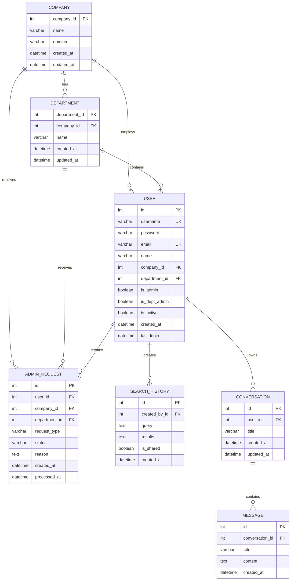

# 특허 분석 시스템 문제 해결 가이드

## 목차
1. [환경변수 설정 문제](#1-환경변수-설정-문제)
2. [포트 충돌 문제](#2-포트-충돌-문제)
3. [데이터베이스 정리](#3-데이터베이스-정리)
4. [시스템 구조](#4-시스템-구조)

---

## 1. 환경변수 설정 문제

### 문제 상황
```
psycopg2.OperationalError: connection to server at "localhost" (127.0.0.1),
port 5432 failed: fe_sendauth: no password supplied
```

### 원인
Django가 `.env` 파일을 자동으로 로드하지 않아서 데이터베이스 비밀번호를 읽지 못함

### 해결 방법

#### 1) `python-dotenv` 패키지 설치
```bash
cd /home/juhyeong/workspace/final_project/SKN15-FINAL-3TEAM/patent_backend
pip install python-dotenv
```

**명령어 의미:**
- `pip install python-dotenv`: `.env` 파일의 환경변수를 Python에서 로드하는 패키지 설치

#### 2) `settings.py` 수정
파일 위치: `SKN15-FINAL-3TEAM/patent_backend/config/settings.py`

```python
# 파일 상단에 추가
from dotenv import load_dotenv

# Build paths inside the project like this: BASE_DIR / 'subdir'.
BASE_DIR = Path(__file__).resolve().parent.parent

# Load environment variables from .env file
load_dotenv(BASE_DIR / '.env')
```

**코드 의미:**
- `load_dotenv(BASE_DIR / '.env')`: 프로젝트 루트의 `.env` 파일을 로드하여 환경변수로 등록

#### 3) `.env` 파일 확인
파일 위치: `SKN15-FINAL-3TEAM/patent_backend/.env`

```env
# Database - PostgreSQL 연결 정보
DB_NAME=patentdb
DB_USER=final_play
DB_PASSWORD=1q2w3e4r
DB_HOST=localhost
DB_PORT=5432
```

**주의:** 이 파일은 `.gitignore`에 포함되어 GitHub에 업로드되지 않음

#### 4) 환경변수 로드 확인
```bash
cd /home/juhyeong/workspace/final_project/SKN15-FINAL-3TEAM/patent_backend
python -c "
import os
from pathlib import Path
from dotenv import load_dotenv

BASE_DIR = Path('.').resolve()
load_dotenv(BASE_DIR / '.env')

print('DB_NAME:', os.getenv('DB_NAME'))
print('DB_USER:', os.getenv('DB_USER'))
print('DB_PASSWORD:', '***' if os.getenv('DB_PASSWORD') else 'NOT SET')
print('DB_HOST:', os.getenv('DB_HOST'))
print('DB_PORT:', os.getenv('DB_PORT'))
"
```

**명령어 의미:**
- `python -c "..."`: Python 코드를 직접 실행하여 환경변수가 제대로 로드되는지 테스트
- `os.getenv()`: 환경변수 값을 가져옴

---

## 2. 포트 충돌 문제

### 문제 상황
```
⚠ Port 3000 is in use, trying 3001 instead.
```

### 원인
백그라운드에서 실행 중인 여러 개의 Next.js 개발 서버가 포트를 점유

### 해결 방법

#### 1) 포트 사용 프로세스 확인
```bash
lsof -ti:3000
```

**명령어 의미:**
- `lsof`: List Open Files - 열린 파일 및 네트워크 포트 목록 확인
- `-t`: PID(프로세스 ID)만 출력
- `-i:3000`: 포트 3000을 사용하는 프로세스 찾기

#### 2) 특정 포트의 프로세스 강제 종료
```bash
lsof -ti:3000 | xargs kill -9
```

**명령어 의미:**
- `|`: 파이프 - 앞 명령의 출력을 뒤 명령의 입력으로 전달
- `xargs`: 표준 입력을 명령어 인자로 변환
- `kill -9`: 프로세스 강제 종료 (SIGKILL)
- `-9`: 무조건 종료 시그널

#### 3) 여러 포트 동시 정리
```bash
lsof -ti:3000 -ti:3001 -ti:3002 | xargs -r kill -9
```

**명령어 의미:**
- `-ti:3000 -ti:3001 -ti:3002`: 여러 포트를 동시에 확인
- `xargs -r`: 입력이 없으면 명령 실행 안 함 (빈 결과 에러 방지)

#### 4) Next.js 개발 서버 프로세스 확인
```bash
ps aux | grep "next dev" | grep -v grep
```

**명령어 의미:**
- `ps aux`: 시스템의 모든 프로세스 출력
  - `a`: 모든 사용자의 프로세스
  - `u`: 사용자 중심 형식
  - `x`: 터미널과 연결되지 않은 프로세스 포함
- `grep "next dev"`: "next dev" 문자열 포함 프로세스만 필터링
- `grep -v grep`: grep 명령 자체는 결과에서 제외

#### 5) Next.js 프로세스 종료
```bash
pkill -f "next dev"
```

**명령어 의미:**
- `pkill`: 프로세스 이름으로 종료
- `-f`: 전체 커맨드 라인에서 패턴 검색

#### 6) 백엔드 서버 포트 확인
```bash
lsof -ti:8000 || echo "포트 8000 사용 안함"
```

**명령어 의미:**
- `||`: OR 연산자 - 앞 명령 실패 시 뒤 명령 실행
- `echo`: 메시지 출력

---

## 3. 데이터베이스 정리

### 문제 상황
삭제된 Django 앱(chat, history, patents)의 테이블이 데이터베이스에 남아있음

### 발견된 불필요한 테이블
- `examinationcriteria` (0개)
- `papers` (0개)
- `patentlaws` (0개)
- `patents` (0개)
- `rejectiondecisions` (0개)

### 해결 방법

#### 1) 데이터베이스 테이블 목록 확인
```bash
cd /home/juhyeong/workspace/final_project/SKN15-FINAL-3TEAM/patent_backend
python manage.py shell -c "
from django.db import connection
cursor = connection.cursor()

cursor.execute(\"\"\"
    SELECT table_name
    FROM information_schema.tables
    WHERE table_schema = 'public'
    AND table_type = 'BASE TABLE'
    ORDER BY table_name;
\"\"\")

tables = cursor.fetchall()
for table in tables:
    cursor.execute(f'SELECT COUNT(*) FROM \"{table[0]}\"')
    count = cursor.fetchone()[0]
    print(f'{table[0]}: {count}개')
"
```

**명령어 의미:**
- `python manage.py shell`: Django 셸 실행
- `-c "..."`: 명령어를 문자열로 전달하여 실행
- `information_schema.tables`: PostgreSQL 시스템 카탈로그 (메타데이터)
- `table_schema = 'public'`: public 스키마의 테이블만 조회
- `table_type = 'BASE TABLE'`: 일반 테이블만 조회 (뷰 제외)

#### 2) 불필요한 테이블 삭제
```bash
python manage.py shell -c "
from django.db import connection

cursor = connection.cursor()

tables_to_drop = [
    'examinationcriteria',
    'papers',
    'patentlaws',
    'patents',
    'rejectiondecisions'
]

for table in tables_to_drop:
    cursor.execute(f'DROP TABLE IF EXISTS {table} CASCADE')
    print(f'✓ {table} 삭제 완료')

connection.commit()
"
```

**명령어 의미:**
- `DROP TABLE IF EXISTS`: 테이블이 존재하면 삭제
- `CASCADE`: 해당 테이블과 연관된 제약조건, 뷰 등도 함께 삭제
- `connection.commit()`: 변경사항을 데이터베이스에 확정

#### 3) 만료된 JWT 토큰 정리
```bash
python manage.py shell -c "
from rest_framework_simplejwt.token_blacklist.models import OutstandingToken
from django.utils import timezone

expired_tokens = OutstandingToken.objects.filter(expires_at__lt=timezone.now())
expired_count = expired_tokens.count()

print(f'만료된 토큰 개수: {expired_count}개')
expired_tokens.delete()
print(f'✓ {expired_count}개 삭제 완료')
"
```

**명령어 의미:**
- `OutstandingToken`: JWT 토큰 추적 모델
- `expires_at__lt=timezone.now()`: 만료 시간이 현재 시간보다 이전인 것
- `__lt`: Less Than (미만)
- `.delete()`: 해당 레코드 삭제

#### 4) 정리 결과
- **테이블 삭제**: 21개 → 16개 (5개 감소)
- **JWT 토큰**: 38개 → 14개 (24개 만료 토큰 삭제)

---

## 4. 시스템 구조

### 최종 데이터베이스 ERD



### 시스템 구성

#### 백엔드 (Django REST Framework)
- **포트**: 8000
- **위치**: `SKN15-FINAL-3TEAM/patent_backend/`
- **실행**: `python manage.py runserver 0.0.0.0:8000`
- **데이터베이스**: PostgreSQL (patentdb)

#### 프론트엔드 (Next.js 15.2.4)
- **포트**: 3000
- **위치**: `SKN15-FINAL-3TEAM/patent_frontend/`
- **실행**: `npm run dev`

### 주요 테이블 현황
| 테이블 | 레코드 수 | 용도 |
|--------|----------|------|
| user | 14개 | 사용자 계정 |
| company | 4개 | 회사 정보 |
| department | 11개 | 부서 정보 |
| admin_request | 9개 | 관리자 권한 요청 |
| search_history | 0개 | 검색 기록 (빈 테이블) |
| chatbot_conversation | 0개 | 챗봇 대화방 (빈 테이블) |
| chatbot_message | 0개 | 챗봇 메시지 (빈 테이블) |

---

## 5. 일반적인 문제 해결 흐름

### 서버 시작 시 체크리스트

1. **환경변수 확인**
   ```bash
   cat .env | grep DB_
   ```

2. **PostgreSQL 실행 확인**
   ```bash
   ps aux | grep postgres | grep -v grep
   ```

3. **포트 사용 확인**
   ```bash
   # 백엔드 포트
   lsof -ti:8000

   # 프론트엔드 포트
   lsof -ti:3000
   ```

4. **Django 설정 확인**
   ```bash
   cd patent_backend
   python manage.py check
   ```

5. **서버 실행**
   ```bash
   # 백엔드
   cd patent_backend
   python manage.py runserver 0.0.0.0:8000

   # 프론트엔드
   cd patent_frontend
   npm run dev
   ```

### CORS 문제 확인
```bash
curl -v -H "Origin: http://localhost:3000" http://localhost:8000/api/accounts/companies/ 2>&1 | grep -i "access-control"
```

**기대 출력:**
```
< access-control-allow-origin: http://localhost:3000
< access-control-allow-credentials: true
```

---

## 6. 유용한 명령어 정리

### 포트 관련
```bash
# 특정 포트 사용 프로세스 확인
lsof -ti:포트번호

# 프로세스 종료
kill -9 PID

# 포트의 모든 프로세스 종료
lsof -ti:포트번호 | xargs kill -9
```

### 데이터베이스 관련
```bash
# Django 셸 실행
python manage.py shell

# 마이그레이션 확인
python manage.py showmigrations

# 마이그레이션 적용
python manage.py migrate

# Django 설정 체크
python manage.py check
```

### 프로세스 관련
```bash
# 모든 프로세스 확인
ps aux

# 특정 프로세스 검색
ps aux | grep 프로세스명

# 프로세스 이름으로 종료
pkill -f "프로세스명"
```

---

## 7. 보안 주의사항

### GitHub에 올리면 안 되는 파일
1. `.env` - 데이터베이스 비밀번호, API 키 포함
2. `db.sqlite3` - 개발용 데이터베이스
3. `__pycache__/` - Python 캐시 파일
4. `node_modules/` - Node.js 패키지
5. `.next/` - Next.js 빌드 파일

### .gitignore 확인
```bash
cat .gitignore | grep -E "(\.env|db\.sqlite3)"
```

### 환경변수 사용 패턴
```python
# ❌ 잘못된 방법 (하드코딩)
PASSWORD = '1q2w3e4r'

# ✅ 올바른 방법 (환경변수)
PASSWORD = os.getenv('DB_PASSWORD', '')
```

---

## 8. 트러블슈팅 요약

| 문제 | 원인 | 해결 방법 |
|------|------|-----------|
| `no password supplied` | `.env` 파일 미로드 | `load_dotenv()` 추가 |
| `Port 3000 is in use` | 백그라운드 서버 중복 실행 | `lsof -ti:3000 \| xargs kill -9` |
| 불필요한 테이블 존재 | 삭제된 앱의 잔여물 | `DROP TABLE CASCADE` |
| 만료된 JWT 토큰 누적 | 자동 정리 미실행 | `OutstandingToken.objects.filter().delete()` |
| CORS 에러 | 서버 재시작 중 일시적 연결 끊김 | 서버 재시작 완료 후 브라우저 새로고침 |

---

## 작성 정보
- **작성일**: 2025-10-30
- **작성자**: Claude Code
- **프로젝트**: 특허 분석 시스템 (PatentAI)
